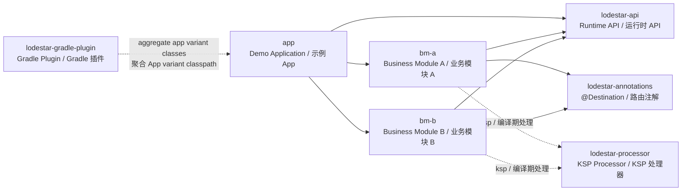
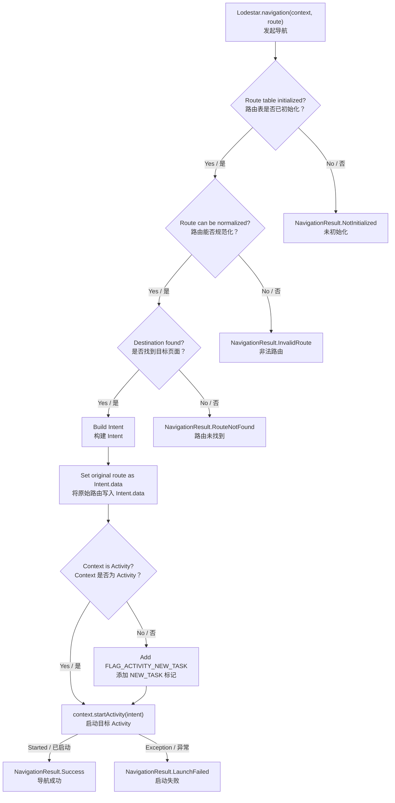

# Lodestar

Lodestar is a lightweight Android Activity routing framework built around compile-time route generation.  
Lodestar 是一个围绕编译期路由生成构建的轻量级 Android Activity 路由框架。

It uses KSP to validate `@Destination` declarations, a Gradle plugin to aggregate module route registries into the final app, and a small runtime API to perform navigation.  
它通过 KSP 校验 `@Destination` 声明，通过 Gradle 插件将各模块路由表聚合到最终 App 中，并通过精简的 Runtime API 执行页面跳转。

## Why Lodestar

Lodestar is designed for predictable, multi-module Android routing without runtime scanning.  
Lodestar 的目标是在不进行运行时扫描的前提下，为多模块 Android 工程提供可预测的路由能力。

- Compile-time validation for route format, Activity type, and duplicate routes.  
  编译期校验路由格式、Activity 类型和重复路由。
- No runtime classpath scanning.  
  不进行运行时 classpath 扫描。
- O(1) route lookup at runtime.  
  运行时路由查找为 O(1)。
- R8-friendly generated code based on direct Activity `.class` references.  
  生成代码使用 Activity `.class` 直接引用，对 R8 友好。
- Supports multi-module Android projects.  
  支持多模块 Android 工程。
- Preserves query and fragment in `Intent.data` while using normalized route keys for lookup.  
  使用规范化路由键查找，同时将 query 和 fragment 保留在 `Intent.data` 中。
- Thread-safe and idempotent initialization.  
  初始化线程安全且幂等。

## Project structure

The repository is split into demo modules, SDK modules, and the Gradle aggregation plugin.  
当前仓库由示例模块、SDK 模块和 Gradle 聚合插件组成。

```text
lodestar
├── app                       # Demo application / 示例 App
├── bm-a                      # Demo business module A / 示例业务模块 A
├── bm-b                      # Demo business module B / 示例业务模块 B
├── lodestar-annotations      # @Destination annotation / 路由注解
├── lodestar-processor        # KSP processor / KSP 编译期处理器
├── lodestar-api              # Runtime API / 运行时 API
└── lodestar-gradle-plugin    # Gradle aggregation plugin / Gradle 聚合插件
```

Module relationship overview:
模块关系概览：



Current development setup resolves the Gradle plugin from the local included build.  
当前开发环境通过本地 included build 解析 Gradle 插件。

```gradle
pluginManagement {
    includeBuild('lodestar-gradle-plugin')
}
```

When Lodestar is published as an SDK, this local `includeBuild` can be replaced by normal plugin and dependency coordinates.  
当 Lodestar 发布为 SDK 后，可以将本地 `includeBuild` 替换为正式的插件和依赖坐标。

## Quick start in this repository

This section describes how to use Lodestar from source in the current repository.  
本节说明如何在当前源码工程中接入 Lodestar。

### 1. Apply the Lodestar Gradle plugin to the app module

The application module owns the final cross-module route table, so it must apply the Lodestar plugin.  
最终的跨模块路由表由 application 模块持有，因此 App 模块必须应用 Lodestar 插件。

```gradle
plugins {
    id 'com.android.application'
    id 'org.jetbrains.kotlin.android'
    id 'com.oayilix.lodestar'
}

dependencies {
    implementation project(':lodestar-api')
}
```

### 2. Configure every route-declaring library module

Each module that declares `@Destination` routes should apply KSP and depend on the annotation, processor, and runtime API.  
每个声明 `@Destination` 路由的模块都应启用 KSP，并依赖注解、处理器和运行时 API。

```gradle
plugins {
    id 'com.android.library'
    id 'org.jetbrains.kotlin.android'
    id 'com.google.devtools.ksp'
    id 'com.oayilix.lodestar'
}

dependencies {
    implementation project(':lodestar-annotations')
    ksp project(':lodestar-processor')
    implementation project(':lodestar-api')
}
```

The Lodestar plugin is safe to apply to library modules. Library modules generate local KSP registries; the final route aggregation is performed by the application variant.  
Lodestar 插件可以安全应用到 library 模块。library 模块通过 KSP 生成局部路由表，最终聚合由 application variant 执行。

### 3. Declare a destination Activity

Annotate a concrete `Activity` with `@Destination`.  
使用 `@Destination` 标注一个具体的 `Activity`。

```kotlin
import androidx.appcompat.app.AppCompatActivity
import com.oayilix.lodestar.annotations.Destination

@Destination(
    url = "lodestar://example.com/app/first",
    description = "First page"
)
class FirstActivity : AppCompatActivity()
```

Route declaration rules:  
路由声明规则：

- Must be an absolute URI with scheme and host.  
  必须是包含 scheme 和 host 的绝对 URI。
- Must not contain query or fragment in `@Destination`.  
  `@Destination` 中不能包含 query 或 fragment。
- Must annotate a concrete, public Activity class.  
  必须标注具体且 public 的 Activity 类。
- Duplicate routes in the same module fail during KSP processing.  
  同一模块内的重复路由会在 KSP 阶段失败。
- Duplicate routes across modules fail during App classpath aggregation.  
  跨模块重复路由会在 App classpath 聚合阶段失败。

Valid route declaration:  
合法路由声明：

```text
lodestar://example.com/app/first
```

Invalid route declarations:  
非法路由声明：

```text
/app/first
lodestar:///app/first
lodestar://example.com/app/first?id=42
lodestar://example.com/app/first#section
```

### 4. Initialize Lodestar

Initialize once, usually in `Application.onCreate()`.  
通常在 `Application.onCreate()` 中初始化一次。

```kotlin
import android.app.Application
import com.oayilix.lodestar.api.Lodestar
import com.oayilix.lodestar.api.InitializationResult

class MyApplication : Application() {

    override fun onCreate() {
        super.onCreate()

        when (val result = Lodestar.init()) {
            is InitializationResult.Success -> {
                // Routes loaded successfully.
            }
            is InitializationResult.AlreadyInitialized -> {
                // Safe to ignore.
            }
            is InitializationResult.Failure -> {
                // Log or report result.cause.
            }
        }
    }
}
```

`Lodestar.init()` is thread-safe and idempotent. A failed initialization does not publish partial routes.  
`Lodestar.init()` 是线程安全且幂等的；初始化失败时不会发布部分路由表。

### 5. Navigate by route

Call `Lodestar.navigation()` with a route URI.  
使用路由 URI 调用 `Lodestar.navigation()`。

```kotlin
import com.oayilix.lodestar.api.Lodestar
import com.oayilix.lodestar.api.NavigationResult

val result = Lodestar.navigation(
    context = this,
    route = "lodestar://example.com/app/second"
)

when (result) {
    is NavigationResult.Success -> {
        // Navigation started.
    }
    NavigationResult.NotInitialized -> {
        // Call Lodestar.init() before navigation.
    }
    is NavigationResult.InvalidRoute -> {
        // Route URI is malformed or relative.
    }
    is NavigationResult.RouteNotFound -> {
        // No destination matches the normalized route key.
    }
    is NavigationResult.LaunchFailed -> {
        // Android rejected or failed to start the Activity.
    }
}
```

You can configure the `Intent` before launch.  
你可以在启动前配置 `Intent`。

```kotlin
Lodestar.navigation(this, "lodestar://example.com/app/detail?id=42#comment") {
    putExtra("from", "home")
    addFlags(Intent.FLAG_ACTIVITY_CLEAR_TOP)
}
```

Lookup uses a normalized `scheme://host/path` key. Query and fragment do not participate in route lookup, but the original URI is assigned to `Intent.data`, so the destination can parse it.  
查找使用规范化后的 `scheme://host/path` 路由键。query 和 fragment 不参与路由匹配，但原始 URI 会写入 `Intent.data`，目标页面可以自行解析。

```kotlin
val id = intent.data?.getQueryParameter("id")
val fragment = intent.data?.fragment
```

When navigation starts from a non-Activity `Context`, Lodestar automatically adds `FLAG_ACTIVITY_NEW_TASK`.  
当从非 Activity `Context` 发起导航时，Lodestar 会自动添加 `FLAG_ACTIVITY_NEW_TASK`。

## Route matching behavior

Runtime route normalization converts caller input into a stable lookup key.  
运行时路由规范化会将调用方输入转换为稳定的查找键。

- Scheme and host are lowercased.  
  scheme 和 host 会转为小写。
- Path is normalized.  
  path 会被规范化。
- Empty path becomes `/`.  
  空 path 会转为 `/`。
- Query and fragment are ignored for lookup.  
  query 和 fragment 不参与查找。
- Leading or trailing whitespace is rejected.  
  前后空白会被拒绝。

Example:  
示例：

```text
Input:  LODESTAR://Example.COM/app/./first?id=42#section
Lookup: lodestar://example.com/app/first
Data:   LODESTAR://Example.COM/app/./first?id=42#section
```

The destination Activity receives the original route as `Intent.data`.  
目标 Activity 会通过 `Intent.data` 接收原始路由。

Navigation decision flow:
导航决策流程：



## Core implementation

Lodestar is split into three phases.  
Lodestar 分为三个阶段。

Build-time and runtime pipeline:
构建期与运行时流水线：

```mermaid
flowchart LR
    Source["@Destination Activity source\n带注解的 Activity 源码"]
    Validate["KSP validation\nKSP 校验"]
    Registry["LodestarRegistry_* per module\n每个模块的局部路由表"]
    Aggregate["Gradle app variant aggregation\nGradle App variant 聚合"]
    Mapping["LodestarMapping\n稳定聚合入口"]
    Init["Lodestar.init()\n初始化加载"]
    ImmutableMap["Immutable route map\n不可变路由表"]
    Navigate["Lodestar.navigation()\n运行时导航"]

    Source --> Validate
    Validate --> Registry
    Registry --> Aggregate
    Aggregate --> Mapping
    Mapping --> Init
    Init --> ImmutableMap
    ImmutableMap --> Navigate
```



### 1. Compile-time route generation

`lodestar-processor` scans `@Destination` annotations with KSP.  
`lodestar-processor` 使用 KSP 扫描 `@Destination` 注解。

For every route declaration, it validates the target and route contract.  
对于每个路由声明，它会校验目标类和路由契约。

- The target must be a concrete Activity.  
  目标必须是具体的 Activity。
- The class must be public.  
  类必须是 public。
- The route must be absolute and contain scheme plus host.  
  路由必须是绝对 URI，并包含 scheme 和 host。
- Query and fragment must not be declared in annotations.  
  注解声明中不能包含 query 和 fragment。
- Routes must be unique inside the declaring module.  
  声明模块内的路由必须唯一。

The processor then uses KotlinPoet to generate a deterministic module registry.
处理器随后使用 KotlinPoet 生成确定性的模块局部路由表。

```kotlin
public object LodestarRegistry_xxxxxxxx {
    @JvmStatic
    public fun get(): Map<String, Class<out Activity>> {
        val routes = LinkedHashMap<String, Class<out Activity>>()
        routes["lodestar://example.com/app/first"] = FirstActivity::class.java
        return Collections.unmodifiableMap(routes)
    }
}
```

Generated registries use direct Activity class literals. This is intentional: R8 can see and rewrite these references safely.  
生成的路由表使用 Activity 类字面量直接引用。这是刻意设计的：R8 可以安全识别并重写这些引用。

KotlinPoet is used to avoid manually concatenating source text. It handles imports, type names, generics, and route string escaping while keeping the generated source readable during debugging.
使用 KotlinPoet 是为了避免手动拼接源码文本。它会处理 import、类型名、泛型和路由字符串转义，同时保留生成源码的可读性，方便调试。

`@JvmStatic` is required because the Gradle aggregation step invokes every registry through a JVM static `get()` method.
必须保留 `@JvmStatic`，因为 Gradle 聚合阶段会通过 JVM 静态 `get()` 方法调用每个局部路由表。

### 2. Application classpath aggregation

`lodestar-gradle-plugin` hooks into Android application variants and transforms scoped class artifacts.  
`lodestar-gradle-plugin` 接入 Android application variant，并转换 scoped class artifacts。

It performs the final cross-module aggregation.  
它负责最终的跨模块聚合。

- Discovers generated `LodestarRegistry_*` classes.  
  发现生成的 `LodestarRegistry_*` 类。
- Detects duplicate routes across modules.  
  检测跨模块重复路由。
- Merges service descriptors under `META-INF/services/`.  
  合并 `META-INF/services/` 下的 service 描述文件。
- Strips invalid upstream JAR signature metadata while repacking.  
  重新打包时移除上游 JAR 中会失效的签名元数据。
- Rejects conflicting duplicate class entries.  
  拒绝内容冲突的重复 class 条目。
- Writes a stable aggregate class.  
  写入稳定的聚合入口类。

```text
com.oayilix.lodestar.mapping.LodestarMapping
```

The runtime loads this stable class name during initialization.  
运行时会在初始化阶段加载这个稳定类名。

### 3. Runtime navigation

`lodestar-api` exposes the `Lodestar` entry point.  
`lodestar-api` 暴露 `Lodestar` 入口。

Runtime behavior:  
运行时行为：

- `Lodestar.init()` loads `LodestarMapping.get()` by stable class name.  
  `Lodestar.init()` 通过稳定类名加载 `LodestarMapping.get()`。
- The loaded map is verified and then published as an immutable map.  
  加载到的 map 会先被校验，然后作为不可变 map 发布。
- `Lodestar.navigation()` normalizes the caller route, performs O(1) lookup, builds an `Intent`, preserves the original route in `Intent.data`, and returns a structured `NavigationResult`.  
  `Lodestar.navigation()` 会规范化调用方路由、执行 O(1) 查找、构建 `Intent`、将原始路由保存在 `Intent.data` 中，并返回结构化的 `NavigationResult`。

## R8 / ProGuard

`lodestar-api` ships a consumer rule.  
`lodestar-api` 会携带 consumer rule。

```proguard
-keep class com.oayilix.lodestar.mapping.LodestarMapping {
    public static java.util.Map get();
}
```

The aggregate entry point must keep its stable name because `Lodestar.init()` loads it by reflection.  
聚合入口必须保留稳定类名，因为 `Lodestar.init()` 会通过反射加载它。

Module registries and Activity references are direct bytecode references and can be optimized by R8.  
模块局部路由表和 Activity 引用都是直接字节码引用，可以被 R8 优化。

## Logging

Lodestar is silent by default. You can replace the logger.  
Lodestar 默认静默，你可以替换日志出口。

```kotlin
Lodestar.logger = LodestarLogger { level, message, cause ->
    // Bridge to your logging/reporting stack.
}
```

## Build and verification

Use the following commands for common verification.  
可以使用以下命令进行常规验证。

```bash
./gradlew check
./gradlew :app:assembleRelease
./gradlew -p lodestar-gradle-plugin check
```

The release demo build enables minification, so it verifies the generated route mapping under R8.  
示例 App 的 release 构建启用了代码压缩，因此可以验证 R8 场景下的生成路由表。

## Current limitations

The current repository is ready for source-level usage and internal validation, but SDK publishing work is still pending.  
当前仓库已可用于源码级接入和内部验证，但 SDK 发布相关工作仍未完成。

- The project is currently wired as a source repository with local project dependencies.  
  当前项目仍以源码仓库方式组织，使用本地 project 依赖。
- Maven coordinates are not published yet.  
  Maven 坐标尚未发布。
- KSP processor tests currently cover policy and source generation logic; full compile-testing fixtures can be added later for deeper processor integration coverage.  
  KSP 处理器测试目前覆盖策略和源码生成逻辑；后续可增加完整 compile-testing fixture，以提升处理器集成测试深度。
- The Gradle plugin transforms the full application scoped classpath to aggregate routes. This is robust for the current demo, but large production apps should benchmark build time and cache behavior before broad rollout.  
  Gradle 插件会转换完整 application scoped classpath 来聚合路由；这对当前 demo 是稳定的，但大型生产 App 在大规模接入前应压测构建耗时和缓存行为。

## Planned SDK publishing shape

After publishing, a consumer project should be able to use a shape similar to the following.  
发布后，消费方项目应可以使用类似下面的接入方式。

```gradle
plugins {
    id 'com.oayilix.lodestar' version '<lodestar-version>'
    id 'com.google.devtools.ksp'
}

dependencies {
    implementation 'io.github.oayilix:lodestar-api:<lodestar-version>'
    implementation 'io.github.oayilix:lodestar-annotations:<lodestar-version>'
    ksp 'io.github.oayilix:lodestar-processor:<lodestar-version>'
}
```

Until artifacts are published, use the project dependencies shown in the quick start section.  
在正式产物发布前，请使用快速开始章节中的 project 依赖方式接入。
